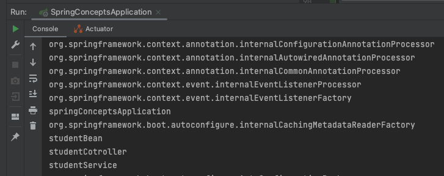

# Spring Concepts

### What is Spring?

Spring is a powerful `lightweight` application development `framework`. 

The `framework`, in broader sense, can be defined as a structure where we find solution of the various technical problems.


### What are the advantage of Spring Framework?

1. `POJO implementation` : Relieve developers to **inherit any class ** using Annotatons like `@Component` , `@Service` etc. 
2. `Remove boilerplate coding`: Predefined Templates , like JDBC template ( no need to write code for creating statement, commiting, closing connection etc), Hibernate, JPA etc. 
3. `Dependency Injection and Inversion of Cotnrol`: Loose coupling between objects

```java
//Employee and Address (tight coupling)
class Employee{  
Address address;  
Employee(){  
address=new Address();  
}  
}  
```

```java
//IOC container is responsible to inject the dependency
class Employee{  
Address address;  
Employee(Address address){  
this.address=address;  
}  
}  
```
### What are the different Modules of Spring Framework?

The Spring framework comprises several modules such as `IOC`, `AOP`, `DAO`, `Context`,` ORM`, `WEB MVC` etc.

# Topics 

## Bean

What ? It's just the `instance of a class` manage by `spring container`

## @Component

Using this annotation, we **can create a bean of Object**

- @Service : It's also a @Component
```java
@Target({ElementType.TYPE})
@Retention(RetentionPolicy.RUNTIME)
@Documented
@Component
public @interface Service {
    @AliasFor(
        annotation = Component.class
    )
    String value() default "";
}

```
- @Repository: It's also a @Component
```java
@Target({ElementType.TYPE})
@Retention(RetentionPolicy.RUNTIME)
@Documented
@Component
public @interface Repository {
    @AliasFor(
        annotation = Component.class
    )
    String value() default "";
}

```
- @Controller
```java
@Target({ElementType.TYPE})
@Retention(RetentionPolicy.RUNTIME)
@Documented
@Component
public @interface Controller {
    @AliasFor(
        annotation = Component.class
    )
    String value() default "";
}

```

### How to know if bean is created?

We can check all the bean when application is initialized using `applicationContext.getBeanDefinitionNames()`

```java
@SpringBootApplication
public class SpringConceptsApplication {

    public static void main(String[] args) {

        ApplicationContext applicationContext = SpringApplication.run(SpringConceptsApplication.class, args);

        //Will show all the beans i.e. instance of object which are created for you: Spring framework beans
        Arrays.stream(applicationContext.getBeanDefinitionNames()).forEach(System.out::println);
    }

}
```

When you will run this, you will be able to see all the beans(**instances**) generated.



### How @SpringBootApplication reads about beans?

@SpringBootApplication is the collection of the important annotation i.e **SpringBootConfiguration** , **EnableAutoConfiguration** and **ComponentScan**


- **ComponentScan** will scan for all the component in the applicaiton.
    - **Object should be at the root** to scan all the beans using @ComponentScan

```java
@Target({ElementType.TYPE})
@Retention(RetentionPolicy.RUNTIME)
@Documented
@Inherited
@SpringBootConfiguration
@EnableAutoConfiguration
@ComponentScan(
    excludeFilters = {@Filter(
    type = FilterType.CUSTOM,
    classes = {TypeExcludeFilter.class}
), @Filter(
    type = FilterType.CUSTOM,
    classes = {AutoConfigurationExcludeFilter.class}
)}
)
public @interface SpringBootApplication {}
```
