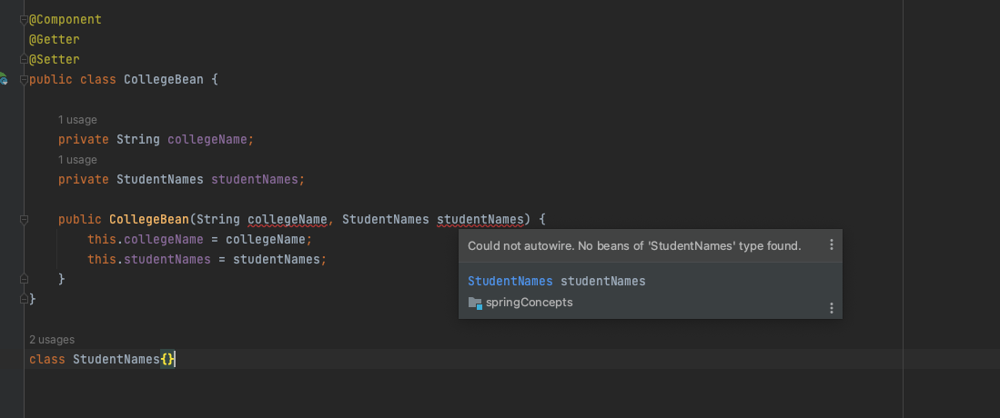

# Spring Concepts

### Q) What is Spring?

Spring is a powerful `lightweight` application development `framework`. 

The `framework`, in broader sense, can be defined as a structure where we find solution of the various technical problems.


### Q) What are the advantage of Spring Framework?

1. `POJO implementation` : Relieve developers to **inherit any class ** using Annotatons like `@Component` , `@Service` etc. 
2. `Remove boilerplate coding`: Predefined Templates , like JDBC template ( no need to write code for creating statement, commiting, closing connection etc), Hibernate, JPA etc. 
3. `Dependency Injection and Inversion of Cotnrol`: Loose coupling between objects

```java
//Employee and Address (tight coupling)
class Employee{  
Address address;  
Employee(){  
address=new Address();  
}  
}  
```

```java
//IOC container is responsible to inject the dependency
class Employee{  
Address address;  
Employee(Address address){  
this.address=address;  
}  
}  
```
### Q) What are the different Modules of Spring Framework?

The Spring framework comprises several modules such as `IOC`, `AOP`, `DAO`, `Context`,` ORM`, `WEB MVC` etc.

# Topics 

## Q) @Bean

What ? It's just the `instance of a class` manage by `spring container`

## @Component

Using this annotation, we **can create a bean of Object**

- @Service : It's also a @Component
```java
@Target({ElementType.TYPE})
@Retention(RetentionPolicy.RUNTIME)
@Documented
@Component
public @interface Service {
    @AliasFor(
        annotation = Component.class
    )
    String value() default "";
}

```
- @Repository: It's also a @Component
```java
@Target({ElementType.TYPE})
@Retention(RetentionPolicy.RUNTIME)
@Documented
@Component
public @interface Repository {
    @AliasFor(
        annotation = Component.class
    )
    String value() default "";
}

```
- @Controller
```java
@Target({ElementType.TYPE})
@Retention(RetentionPolicy.RUNTIME)
@Documented
@Component
public @interface Controller {
    @AliasFor(
        annotation = Component.class
    )
    String value() default "";
}

```

### How to know if bean is created?

We can check all the bean when application is initialized using `applicationContext.getBeanDefinitionNames()`

```java
@SpringBootApplication
public class SpringConceptsApplication {

    public static void main(String[] args) {

        ApplicationContext applicationContext = SpringApplication.run(SpringConceptsApplication.class, args);

        //Will show all the beans i.e. instance of object which are created for you: Spring framework beans
        Arrays.stream(applicationContext.getBeanDefinitionNames()).forEach(System.out::println);
    }

}
```

When you will run this, you will be able to see all the beans(**instances**) generated.


### How @SpringBootApplication reads about beans?

@SpringBootApplication is the collection of the important annotation i.e **SpringBootConfiguration** , **EnableAutoConfiguration** and **ComponentScan**


- **ComponentScan** will scan for all the component in the applicaiton.
    - **Object should be at the root** to scan all the beans using @ComponentScan

```java
@Target({ElementType.TYPE})
@Retention(RetentionPolicy.RUNTIME)
@Documented
@Inherited
@SpringBootConfiguration
@EnableAutoConfiguration
@ComponentScan(
    excludeFilters = {@Filter(
    type = FilterType.CUSTOM,
    classes = {TypeExcludeFilter.class}
), @Filter(
    type = FilterType.CUSTOM,
    classes = {AutoConfigurationExcludeFilter.class}
)}
)
public @interface SpringBootApplication {}
```

## @Autowire and @Qualifier

## @Autowire
It is used to automatically inject collaborating beans (other associated dependent beans) into our bean.
- The @Autowired annotation can be used on properties, `setter methods, and constructors`


## How it works?

Suppose while creating a Pojo class, if we have some objects inside and we want to create a `parametrised constructor`, then if we don't have  `instances` of the Pojo object it will throw error



1. When I call the call instance it will try to find the instance of it in the Spring Container
```java
@Service
public class UseCollegeBean {

    @Autowired
    private CollegeBean collegeBean;
    
}
```
2. Now we need to create the instance of it so that when we are creating the object of CollegeBean, due to `dependency injection` the instance of both String and Student name will be created

```java
@Component
@Getter
@Setter
public class CollegeBean {

    private String collegeName;
    private StudentNames studentNames;

    public CollegeBean(String collegeName, StudentNames studentNames) {
        this.collegeName = collegeName;
        this.studentNames = studentNames;
    }


}

@Component // As when the CollegeBean is being instanced, then the object of Student is already created.
class StudentNames{}

@Configuration
class SetCollegeName{
    @Bean
    public String getCollegeName(){
        return "BEST COLLEGE";
    }
}
```
## @Qualifier
The @Autowired annotation can be used with @Qualifier annotation to remove the confusion that arises when we have more than one bean of the same type

1. We have two classes that implement the `Score` interface: `ScienceStudent` and `CommerceStudent`. We also have a `CollegeStudent` class that has a dependency on `Score`.


2. We use the `@Qualifier` **annotation to specify which implementation** of the `Score` interface should be injected into the CollegeStudent class.

```java
package com.atquil.springconcepts.autowireAndQualifier.qualifier;


import org.springframework.beans.factory.annotation.Autowired;
import org.springframework.beans.factory.annotation.Qualifier;
import org.springframework.stereotype.Component;


interface Score{
    void topScore();
}

@Component("science")
class ScienceStudent implements Score{
    @Override
    public void topScore() {
        System.out.println("Top score of ScienceStudent:100");

    }
}

@Component("commerce")
class CommerceStudent implements Score{
    @Override
    public void topScore() {
        System.out.println("Top score of CommerceStudent:90");
    }
}
@Component
public class CollegeStudent {
    private final Score score;

    /*
    //Now which Bean to choose, for this?
    public CollegeStudent(Score score) {
        this.score = score;
    }
    */

    @Autowired
    public CollegeStudent(@Qualifier("science") Score score){
        this.score = score;
    }
}

```